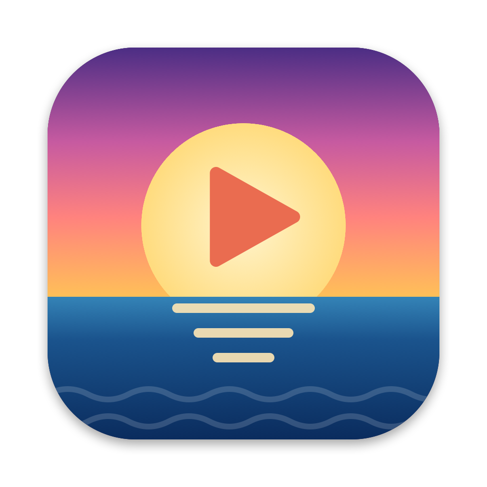

<p align="center">
  
</p>

# Playa

A free, native IPTV player for macOS. Point it at the M3U playlist from your provider and watch live TV, films and series, with a TV guide.

Playa is a player only. It ships with no channels or streams; you bring your own playlist.

> **Status: early.** It works well for daily use on the author's Mac, but for now it has to be built from source. A ready-made download is planned.

## Features

- **Playlists**: add several M3U playlists by URL or from a file and switch between them. Playlists are cached, so the app opens instantly and refreshes in the background.
- **Live TV, Films and Series**: provider playlists that mix all three are split into sections. Series are grouped into shows and seasons.
- **TV guide**: now/next on every channel, plus a full-window schedule grid. The guide is read from the playlist's XMLTV address, or found automatically for Xtream-style `get.php` playlists.
- **Favourites and lists**: star channels, films and shows, or collect them in your own named lists and arrange them in any order.
- **Hide groups** you never use, so a provider's hundreds of groups shrink to the ones you care about.
- **Search** across channels, films and shows.
- **Plays almost anything**: playback uses [mpv](https://mpv.io), with hardware decoding and Metal rendering.
- **Built for big playlists**: tested with a playlist of about 290,000 entries.

## Requirements

- macOS 14 or later
- Xcode
- [XcodeGen](https://github.com/yonaskolb/XcodeGen): `brew install xcodegen`

## Build and run

```sh
git clone <this repository>
cd Playa
./build-app.sh run
```

This generates the Xcode project, builds `Playa.app` in the repository folder and launches it. The first build downloads the prebuilt mpv libraries from [MPVKit](https://github.com/mpvkit/MPVKit), a few hundred megabytes. The resulting app is self-contained and needs nothing else installed. Run the tests with `swift test`.

## Apple TV

There is an early Apple TV version in `tvOS/`. It shares the playlist, guide, series and player code with the Mac app and has its own interface for the remote: Live TV, Films, Series, Search and Settings. Each browsing tab has Favourites, your lists and the playlist's groups on the left and their contents on the right; Live TV can show the right side as a plain list or as a TV guide timeline. Hold select on a list or group to make it the one that opens at launch.

```sh
echo "DEVELOPMENT_TEAM = YOURTEAMID" > Local.xcconfig
xcodegen
open Playa.xcodeproj
```

Replace `YOURTEAMID` with your Apple developer team ID. Choose the **PlayaTV** scheme, pick your Apple TV or a tvOS simulator as the destination and run. In the player, up and down change channel, left and right skip in films and episodes, and Play/Pause pauses.

## Making a release

`./release.sh` archives the Mac app, signs it with your Developer ID certificate, has Apple notarise it and writes `Playa-<version>.zip`. It needs `Local.xcconfig` with your team ID, a "Developer ID Application" certificate in the keychain and a stored notarisation login (`xcrun notarytool store-credentials playa-notary`).

Without a `Local.xcconfig`, `./build-app.sh` signs ad-hoc. That is fine for running your own build; it just doesn't sync.

## Sync between devices

Playlists, favourites, lists, hidden groups and resume positions sync through the user's own iCloud account (key-value storage) between Playa on their devices; nothing passes through any other server. Favourites, lists and resume positions are stored as fingerprints of the stream addresses, never the addresses themselves. Playlist addresses, which include the provider login, are stored as they are, under Apple's standard iCloud encryption (in transit and at rest, not end to end). Playlists added from a file are not synced.

`Playa.app/Contents/MacOS/Playa --diagnose` prints the storage and sync state.

## Using it

1. Click **+** in the toolbar and paste your M3U URL, or choose a `.m3u` file.
2. Pick a channel in the sidebar. Use the **Live TV / Films / Series** switch and the group picker to narrow the list.
3. Click the star on a row to add it to your favourites.
4. Press **⌘G** for the TV guide.

| Shortcut | Action |
|---|---|
| Space | Pause / resume |
| ⌘D | Add or remove the current channel as a favourite |
| ⌘G | Show the TV guide |
| Double-click the video | Full screen |

## One stream at a time

Many IPTV providers allow a single stream per subscription and may ban accounts that open a second one. Playa is built not to do that by accident:

- It never starts a stream by itself. On launch the last channel is selected, but nothing plays until you press play.
- When you switch channels, the old stream is closed before the new one is opened, with a short pause in between.
- It does not reconnect a dropped channel automatically; it shows a **Reconnect** button instead.

Auto-play on launch and automatic reconnect can be turned on in **Settings** (⌘,) if your provider allows it. Playa cannot know what your other devices are doing, so watching on two devices at once is still up to you to avoid.

## Privacy

Playlist addresses usually contain your provider login, and so does every stream address inside the playlist. On your device, Playa encrypts what it stores: the playlist list, the cached playlists, favourites, resume positions and the last channel are sealed with a key held in the Keychain. Playlist addresses are also kept in your own iCloud account so your other devices get them; see "Sync between devices". Playa only contacts the addresses in your playlist.

## Project layout

| Path | Contents |
|---|---|
| `Sources/PlayaCore` | Playlist, guide and series parsing. No UI; covered by tests. |
| `Sources/Playa` | The Mac app, plus the stores, sync and mpv player wrapper shared with Apple TV. |
| `tvOS` | The Apple TV interface. |
| `project.yml` | Describes the Xcode project for both apps. `Package.swift` covers the shared core, its tests and a quick `swift build` of the Mac sources. |
| `Support` | `Info.plist`, the icon and the script that draws it. |

## Licence

Playa is released under the [MIT Licence](LICENSE). It links against mpv and FFmpeg through MPVKit's LGPL build; those libraries keep their own licences.
